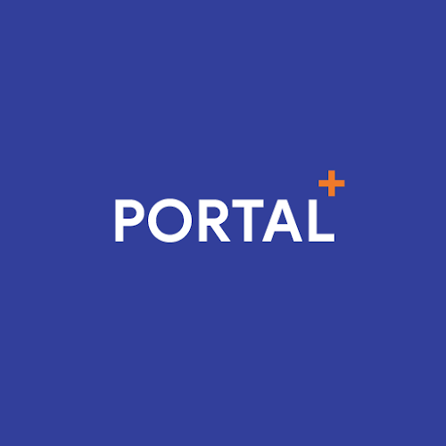

<div id="top"></div>


<!-- PROJECT LOGO -->
<br />
<div align="center">
  <a href="https://github.com/monokaijs/portal-plus">
    
  </a>

<h3 align="center">Portal+ for Greenwich Students</h3>

  <p align="center">
    A better portal for a better experience in learning.
    <br />
    <a href="https://github.com/monokaijs/portal-plus"><strong>Explore the docs »</strong></a>
    <br />
    <br />
    <a href="https://play.google.com/store/apps/details?id=com.nstudio.portalplus">Published on CHPlay</a>
    ·
    <a href="https://github.com/monokaijs/portal-plus/issues">Report Bug</a>
    ·
    <a href="https://github.com/monokaijs/portal-plus/issues">Request Feature</a>
  </p>
</div>


<!-- TABLE OF CONTENTS -->
<details>
  <summary>Table of Contents</summary>
  <ol>
    <li>
      <a href="#about-the-project">About The Project</a>
      <ul>
        <li><a href="#built-with">Built With</a></li>
      </ul>
    </li>
    <li>
      <a href="#getting-started">Getting Started</a>
      <ul>
        <li><a href="#prerequisites">Prerequisites</a></li>
        <li><a href="#installation">Installation</a></li>
      </ul>
    </li>
    <li><a href="#usage">Usage</a></li>
    <li><a href="#roadmap">Roadmap</a></li>
    <li><a href="#contributing">Contributing</a></li>
    <li><a href="#license">License</a></li>
    <li><a href="#contact">Contact</a></li>
    <li><a href="#acknowledgments">Acknowledgments</a></li>
  </ol>
</details>


<!-- ABOUT THE PROJECT -->
## About The Project

<!-- [![Product Name Screen Shot][product-screenshot]](https://play.google.com/store/apps/details?id=com.nstudio.portalplus) -->

As learning at the [University??!?] of Greenwich in Vietnam, I find that the quality of the academic portal is not so good. It makes students harder to find information and feel uncomfortable with a not-modern graphical interface.

I decided to create this project two years ago when I had some free time. This mobile app is just a hobby project to resolve miscellaneous needs and will not be maintained regularly; please note.

The main missions of this project are:
* Provide you with a better graphical interface in this application.
* See your daily & weekly calendar faster, in an easier way.
* Manage your life at school.
* ... and maybe a social place where you can see your buddies?
As this is just a hobby project, feel free to contribute and make a PR if you would like to do so.
I welcome all of you to redistribute or make it better by your way.


<p align="right">(<a href="#top">back to top</a>)</p>


### Built With

Here are using tools, frameworks:

* [React.js](https://reactjs.org/)
* [React Native](https://reactnative.dev/)
* [Redux](https://redux.js.org/)

<p align="right">(<a href="#top">back to top</a>)</p>


<!-- GETTING STARTED -->
## Getting Started
As this is a simple project without Expo, you can clone this project directly and use it in  traditional way.

### Prerequisites

This project requires Node version > 14.x (along with npm).

### Installation

_Below is an example of how you can instruct your audience on installing and setting up your app. This template doesn't rely on any external dependencies or services._

1. Get a free API Key at [https://example.com](https://example.com)
2. Clone the repo
   ```sh
   git clone https://github.com/monokaijs/portal-plus
   ```
3. Install NPM packages
   ```sh
   npm install
   ```
   ... or by yarn
   ```sh
   yarn
   ```
<p align="right">(<a href="#top">back to top</a>)</p>


<!-- USAGE EXAMPLES -->
## Usage

Use this space to show useful examples of how a project can be used. Additional screenshots, code examples and demos work well in this space. You may also link to more resources.

_For more examples, please refer to the [Documentation](https://example.com)_

<p align="right">(<a href="#top">back to top</a>)</p>


<!-- ROADMAP -->
## Roadmap

- [x] Add Changelog
- [x] Add back to top links
- [ ] Add Additional Templates w/ Examples
- [ ] Add "components" document to easily copy & paste sections of the readme
- [ ] Multi-language Support
    - [ ] Vietnamese
    - [x] English

See the [open issues](https://github.com/monokaijs/portal-plus/issues) for a full list of proposed features (and known issues).

<p align="right">(<a href="#top">back to top</a>)</p>


<!-- CONTRIBUTING -->
## Contributing

Contributions are what make the open source community such an amazing place to learn, inspire, and create. Any contributions you make are **greatly appreciated**.

If you have a suggestion that would make this better, please fork the repo and create a pull request. You can also simply open an issue with the tag "enhancement".
Don't forget to give the project a star! Thanks again!

1. Fork the Project
2. Create your Feature Branch (`git checkout -b feature/AmazingFeature`)
3. Commit your Changes (`git commit -m 'Add some AmazingFeature'`)
4. Push to the Branch (`git push origin feature/AmazingFeature`)
5. Open a Pull Request

<p align="right">(<a href="#top">back to top</a>)</p>


<!-- LICENSE -->
## License

Distributed under the MIT License. See `LICENSE.txt` for more information.

<p align="right">(<a href="#top">back to top</a>)</p>


<!-- CONTACT -->
## Contact

MonokaiJs - [@monokaijssss](https://www.facebook.com/monokaijssss) - monokaijs@gmail.com

Project Link: [https://github.com/monokaijs/portal-plus](https://github.com/monokaijs/portal-plus)

<p align="right">(<a href="#top">back to top</a>)</p>


<!-- ACKNOWLEDGMENTS -->
## Acknowledgments

Use this space to list resources you find helpful and would like to give credit to. I've included a few of my favorites to kick things off!

* [React Native Environment Setup](https://reactnative.dev/docs/environment-setup)

<p align="right">(<a href="#top">back to top</a>)</p>


<!-- MARKDOWN LINKS & IMAGES -->
<!-- https://www.markdownguide.org/basic-syntax/#reference-style-links -->
[contributors-shield]: https://img.shields.io/github/contributors/monokaijs/portal-plus.svg?style=for-the-badge
[contributors-url]: https://github.com/monokaijs/portal-plus/graphs/contributors
[forks-shield]: https://img.shields.io/github/forks/monokaijs/portal-plus.svg?style=for-the-badge
[forks-url]: https://github.com/monokaijs/portal-plus/network/members
[stars-shield]: https://img.shields.io/github/stars/monokaijs/portal-plus.svg?style=for-the-badge
[stars-url]: https://github.com/monokaijs/portal-plus/stargazers
[issues-shield]: https://img.shields.io/github/issues/monokaijs/portal-plus.svg?style=for-the-badge
[issues-url]: https://github.com/monokaijs/portal-plus/issues
[license-shield]: https://img.shields.io/github/license/monokaijs/portal-plus.svg?style=for-the-badge
[license-url]: https://github.com/monokaijs/portal-plus/blob/master/LICENSE.txt
[linkedin-shield]: https://img.shields.io/badge/-LinkedIn-black.svg?style=for-the-badge&logo=linkedin&colorB=555
[linkedin-url]: https://linkedin.com/in/monokaijs
[product-screenshot]: images/screenshot.png
